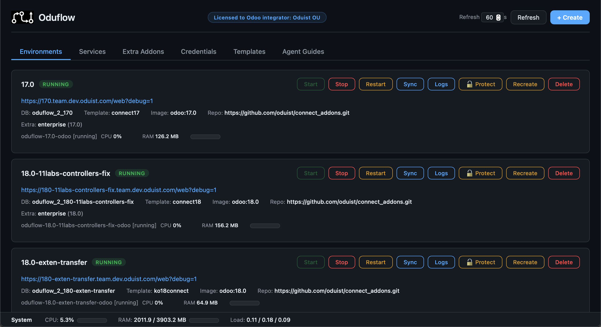

# Oduflow

[TOC]

[](img/envs.png)

An **AI-first** Odoo development and CI tool, powered by **reusable database templates**. Oduflow provisions isolated, ephemeral Odoo environments on Docker — one per git branch — and exposes them to AI coding agents via [MCP](https://modelcontextprotocol.io/), creating a **closed feedback loop** that enables fully autonomous Odoo development.

## Beyond Vibe Coding: Spec-Driven Development

**Vibe coding** — chatting with an AI and eyeballing the output — was the first wave. It works for prototypes, but breaks down on real ERP systems where a module must install cleanly, pass tests, and work against production data.

**Spec-Driven Development (SDD)** is the next step: you write a precise specification of *what* the module should do, and the AI agent autonomously implements *how* — because it has a **closed feedback loop** with the running system:

```
┌─────────────────────────────────────────────────────┐
│                    AI Agent                          │
│          (Cursor, Cline, Amp, Claude, …)             │
└──────┬──────────────────────────────▲────────────────┘
       │ 1. Read spec                 │ 5. Read errors,
       │ 2. Write code                │    fix code,
       │ 3. Install module via MCP    │    retry
       │ 4. Click-test UI via         │
       │    Playwright MCP            │
┌──────▼──────────────────────────────┴────────────────┐
│               Oduflow (MCP Server)                    │
│  • install_odoo_modules → traceback or success        │
│  • run_odoo_tests → test pass/fail with details     │
│  • get_environment_logs → runtime errors              │
│  • upgrade_odoo_modules → upgrade output              │
├──────────────────────────────────────────────────────┤
│            + Playwright MCP / other tools              │
│  • Navigate Odoo UI, click buttons, fill forms        │
│  • Verify business logic end-to-end                   │
│  • Validate acceptance criteria from the spec         │
└──────────────────────────────────────────────────────┘
```

The agent writes code, installs the module, reads the traceback, fixes the error, retries — and when it installs cleanly, it can open the browser via [Playwright MCP](https://github.com/anthropics/mcp-playwright) to click through the UI, verify business flows, and validate acceptance criteria — **all without human intervention**.

| | Vibe Coding | Spec-Driven Development |
|---|---|---|
| **Input** | Conversational prompts | Formal specification with acceptance criteria |
| **Feedback** | Human eyeballs the code | System returns errors, test results, and UI state automatically |
| **Iteration** | Human copy-pastes errors back | Agent retries autonomously via MCP |
| **Scope** | Single files, prototypes | Full modules against real databases |
| **Verification** | "Looks right" | Module installs, tests pass, UI works on production data |

## Key Features

### Core
- **One command to provision** a fully working Odoo instance for any git branch
- **Instant environment creation** from large production databases via PostgreSQL templates and overlayfs
- **Minimal disk footprint** — environments share the template DB and filestore; only per-branch changes consume additional space
- **Template-free mode** — create environments from scratch (`template_name="none"`) when no production dump is available
- **Auto branch creation** — if a branch doesn't exist on the remote, Oduflow clones the default branch and creates the new branch automatically
- **Extra addons repositories** — mount shared addon repos (e.g. Odoo Enterprise) into environments via git worktrees; `addons_path` is auto-merged into `odoo.conf`
- **Environment protection** — protect environments from accidental deletion via a toggle in the dashboard or REST API

### Smart Automation
- **Smart pull** — `pull_and_apply` analyzes changed files (manifest, Python fields, security XML, JS) and automatically decides whether to install, upgrade, restart, or do nothing
- **Auto-install dependencies** — `requirements.txt` (pip) and `apt_packages.txt` (apt) in the repository root are automatically installed when creating an environment
- **Custom odoo.conf** — if the repository contains an `odoo.conf` at its root, it is used instead of the default template
- **Field change detection** — Python files are analyzed for `fields.*` definition changes, triggering module upgrades only when necessary

### Infrastructure
- **Auxiliary services** — managed sidecar containers for Redis, Meilisearch, Elasticsearch, or any other service your Odoo setup needs
- **Traefik auto-HTTPS** — optional reverse proxy with Let's Encrypt certificates for production-like access
- **Stable port registry** — port assignments are persisted in `ports.json` and survive container restarts
- **Resource monitoring** — per-container CPU and RAM stats, plus system-level metrics (memory, load average)

### Integration
- **AI-agent friendly** — the server exposes tools via [Model Context Protocol (MCP)](https://modelcontextprotocol.io/), so LLM-based coding agents (Cursor, Cline, Amp, etc.) can provision and manage Odoo environments programmatically
- **Web dashboard** — a built-in HTML dashboard for managing environments from a browser
- **REST API** — full JSON API for programmatic control from any HTTP client
- **CLI tools** — every MCP tool can be called directly from the command line via `oduflow call`
- **Dual transport** — supports both HTTP (Streamable HTTP) and stdio MCP transports
