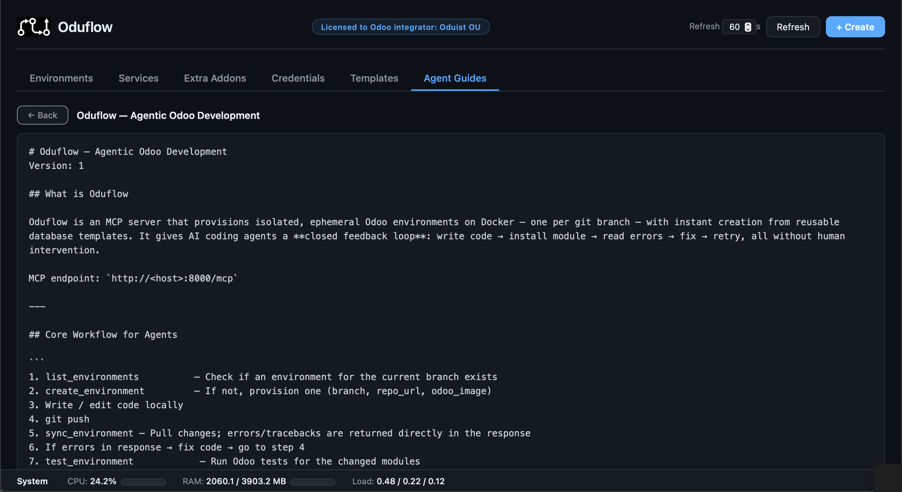

# MCP Tools Reference

[TOC]

All tools are accessible via MCP clients (Cursor, Cline, Amp, etc.) and the CLI (`oduflow call`). A subset is also available via the [REST API](web-api.md).

| Tool | Mutex | Description |
|---|:---:|---|
| **Environment Management** | | |
| `create_environment` | ✓ | Provision an Odoo environment for a branch (clone, DB, container, filestore) |
| `delete_environment` | ✓ | Tear down all resources for a branch |
| `list_environments` | | List all managed environments with status and URLs |
| `get_environment_info` | | Full environment details: DB name, URL, repo, image, template, extra addons, workspace, container status, CPU/RAM stats |
| `start_environment` | | Start a stopped environment |
| `stop_environment` | | Stop a running environment |
| `restart_environment` | | Restart the Odoo container |
| `rebuild_environment` | ✓ | Re-create the container from the same image, preserving DB and filestore |
| **Odoo Operations** | | |
| `pull_and_apply` | ✓ | Git pull + smart analysis → auto install/upgrade/restart |
| `install_odoo_modules` | ✓ | Install Odoo modules (`-i`) |
| `upgrade_odoo_modules` | ✓ | Upgrade Odoo modules (`-u`) |
| `run_odoo_tests` | ✓ | Run Odoo tests for specific modules |
| `get_environment_logs` | | Retrieve recent container logs |
| `exec_in_odoo` | ✓ | Execute an arbitrary shell command inside the Odoo container |
| `read_file_in_odoo` | ✓ | Read a text file or list a directory inside the Odoo container. Supports line ranges (e.g. `"1:50"`) |
| `run_db_query` | ✓ | Execute a SQL query against the environment's PostgreSQL database |
| `reset_admin_password` | ✓ | Reset the admin user password in the Odoo database (default: "test") |
| **Template Management** | | |
| `save_as_template` | ✓ | ⚠️ Save a branch DB + filestore as a new template |
| `list_templates` | | List available template profiles |
| `delete_template` | ✓ | ⚠️ Delete a template profile (DB + files) |
| `import_template_from_odoo` | ✓ | Import a template from a running Odoo instance via database manager API |
| **Auxiliary Services** | | |
| `create_service` | ✓ | Create a managed service container (e.g. Redis, Meilisearch) |
| `delete_service` | ✓ | Stop and remove a service container |
| `update_service` | ✓ | Pull latest image and recreate the service |
| `list_services` | | List all managed service containers |
| `get_service_logs` | | Retrieve service container logs |
| **Service Presets** | | |
| `list_service_presets` | | List saved service presets (configurations that can be restored) |
| `restore_service` | ✓ | Restore a service from a saved preset |
| `delete_service_preset` | | Remove a saved service preset |
| **Repository Auth** | | |
| `setup_repo_auth` | ✓ | Cache git credentials for a private repository |
| **Extra Addons** | | |
| `add_extra_repo` | ✓ | Clone an extra addons repository (e.g. Odoo Enterprise) for use with environments |
| `list_extra_repos` | | List all cloned extra addons repositories |
| `update_extra_repo` | ✓ | Fetch latest changes from the remote for an extra addons repository |
| `delete_extra_repo` | ✓ | Delete a cloned extra addons repository |
| **Agent Instructions** | | |
| `get_agent_instructions` | | Get AI agent instructions for using Oduflow MCP tools |
| `get_odoo_development_guide` | | Get Odoo development standards guide for a specific version (15–19) |

!!! info "Mutex"
    Tools marked with ✓ acquire a per-branch or per-team lock. Operations on different branches can run in parallel, but if another operation on the **same branch** (or team, for team-level tools) is in progress, the call is rejected with `BusyError` ("Another operation is in progress. Try again later.").
