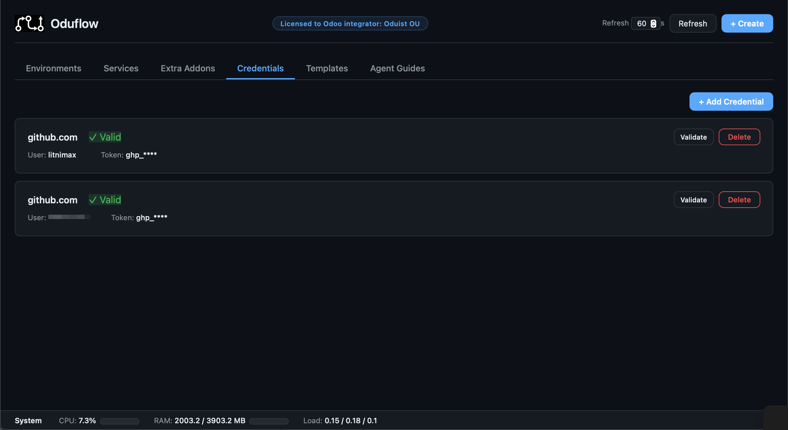

# Authentication & Security

[TOC]

## MCP HTTP Auth

When `ODUFLOW_AUTH_TOKEN` is set, the MCP endpoint (`/mcp`) requires a Bearer token:

```
Authorization: Bearer <your-token>
```

This is implemented via FastMCP's `StaticTokenVerifier`.

## Web Dashboard Auth

The web dashboard and REST API use HTTP Basic authentication with a **separate** password:

- **Username**: `admin`
- **Password**: value of `ODUFLOW_UI_PASSWORD`

This is independent from the MCP Bearer token (`ODUFLOW_AUTH_TOKEN`). Credentials are compared using `hmac.compare_digest` to prevent timing attacks.

## When auth is disabled

MCP auth and Web UI auth are configured independently:

- If `ODUFLOW_AUTH_TOKEN` is empty, the MCP endpoint runs without authentication
- If `ODUFLOW_UI_PASSWORD` is empty, the web dashboard runs without authentication

Warnings are logged on startup for each:

```
WARNING  HTTP auth DISABLED (ODUFLOW_AUTH_TOKEN not set)
WARNING  Web UI auth DISABLED (ODUFLOW_UI_PASSWORD not set)
```

## Git credentials

[](img/credentials.png)

Private repository credentials are stored in the git credential store (`~/.git-credentials`) via the `setup_repo_auth` tool. The clean URL (without credentials) is always used in Docker labels and logs — credentials are never exposed.

## iptables rule

During `oduflow init`, an `iptables ACCEPT` rule is automatically added for the `oduflow-net` Docker bridge interface. This ensures that containers on the shared network can communicate with the host (required for Traefik `host.docker.internal` routing and PostgreSQL access). If `iptables` is not available, the rule is skipped with a warning.

## Odoo security defaults

The bundled `odoo.conf` template includes these security settings:

- `admin_passwd` set to a random value (prevents database manager access)
- `list_db = False` (hides database selector)
- `without_demo = all` (no demo data)
- `max_cron_threads = 0` (disables cron in dev environments)
