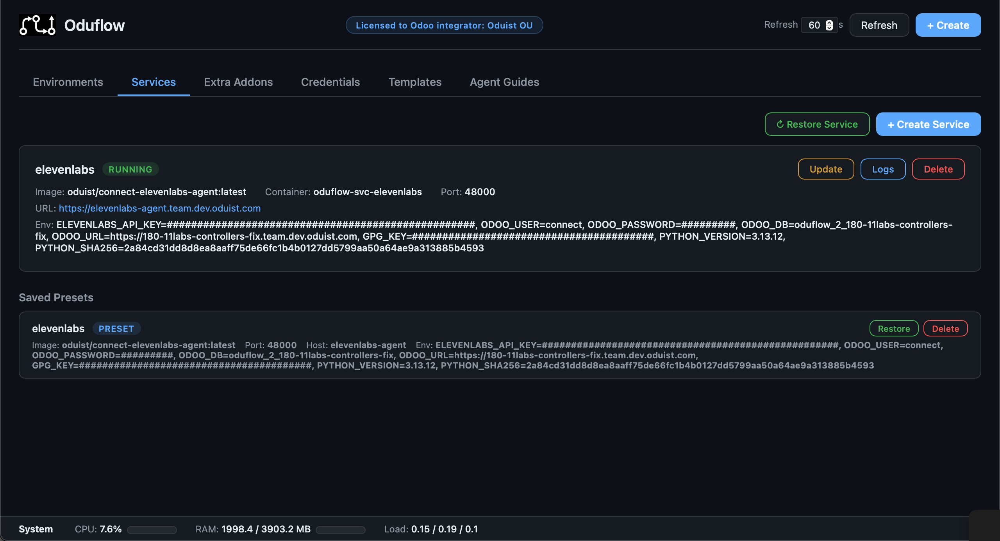

# Auxiliary Services



Oduflow can manage sidecar containers for auxiliary services your Odoo instance depends on — Redis, Meilisearch, Elasticsearch, RabbitMQ, or any other Docker-based service.

## Creating a Service

```bash
# Redis
oduflow call create_service redis redis:7 6379

# Meilisearch with environment variables
oduflow call create_service meilisearch getmeili/meilisearch:v1.6 7700 "" "MEILI_MASTER_KEY=abc123,MEILI_ENV=production"

# Elasticsearch
oduflow call create_service elasticsearch docker.elastic.co/elasticsearch/elasticsearch:8.11.0 9200 "" "discovery.type=single-node,ES_JAVA_OPTS=-Xms512m -Xmx512m"

# MinIO — the image expects its start arguments as the container command
oduflow call create_service '{"name":"minio","image":"minio/minio","port":9000,"command":"server /data"}'

# WireGuard VPN — needs NET_ADMIN to manage tun/iptables
oduflow call create_service '{"name":"vpn","image":"linuxserver/wireguard","port":51820,"net_admin":true}'

# Publish only selected HTTP prefixes, each on its own backend port
oduflow call create_service '{
  "name":"fs",
  "image":"oduist/freeswitch:latest",
  "hostname":"fs",
  "host_mode":true,
  "routes":[
    {"path":"/RPC2","port":8080,"strip_prefix":false},
    {"path":"/portal","port":8080,"strip_prefix":false}
  ]
}'
```

Services are:

- Attached to the team's isolated Docker network `oduflow-{team_id}-net` (reachable by that team's Odoo containers and other services)
- Given an `unless-stopped` restart policy
- Automatically routed through Traefik with HTTPS when in traefik mode
- In Traefik TLS mode, automatically given the exact system mount `oduflow-traefik-acme:/etc/traefik:ro`
- Labeled for management (`oduflow.managed=true`, `oduflow.service=<name>`)
- Always created from a freshly pulled image — `create_service` and `restore_service` explicitly pull before running, so mutable tags like `:latest` get the current published version instead of a stale local cache

Each team has `service_slots = 10` by default. The cap includes running and
stopped managed services; updating or restarting an existing service does not
consume another slot. Delete an unused service to free capacity, or set
`service_slots = 0` to disable the cap.

### Connecting from Odoo

Inside the team's Docker network the service is reachable by its **container
name** — the DNS name is exactly `oduflow-{team_id}-svc-{name}` (e.g.
`oduflow-1-svc-redis`). There is no shorter alias such as `redis` or
`oduflow-svc-redis`. This is precisely the `Container:` / `Internal hostname:`
value that `create_service` and `get_service_info` report, so configure Odoo
against that:

```
oduflow-1-svc-redis:6379
```

The `URL:` line printed by the service tools is the **external** Traefik/host
address, not the internal one — do not use it for in-cluster connections.

`host_mode` services are not on the team network, so they are not resolvable by
container name; reach them via `host.docker.internal` instead.

### Restricted HTTP Path Routes

In Traefik mode, `routes` can replace the single catch-all `port`. Each route
publishes a URL prefix on the service's hostname and forwards it to another
HTTP port of the **same service**. This works in both networking modes:

- Bridge services are reached on their private IP in the team's Docker network.
- `host_mode` services are reached through `host.docker.internal`.

Routes are prefix matches on path-segment boundaries: `/api` accepts `/api` and
`/api/...`, but not `/apix`. When routes are present Oduflow does not create the
hostname-only catch-all router, so every unlisted path receives Traefik's 404
without reaching the service. Set `strip_prefix=true` when the backend serves
from `/`; Traefik then sends `/portal/assets/app.js` as `/assets/app.js` and
adds `X-Forwarded-Prefix: /portal`.

`routes` is intentionally not an arbitrary reverse-proxy configuration: a route
contains only `path`, `port`, and optional `strip_prefix`, and always targets the
same managed service. It is available only with `[routing].mode = "traefik"`.
Raw TCP/UDP protocols cannot be routed by URL path.

### Traefik Certificate Store

When Oduflow terminates TLS through Traefik, every auxiliary service can read
Traefik's certificate store at `/etc/traefik/acme.json`. The mount is implicit:
do not add `oduflow-traefik-acme` to the `volumes` argument, and do not mount a
different volume at `/etc/traefik`. Oduflow always mounts the exact system
volume read-only; there is no wildcard allowance for other `oduflow-*` volumes.
The implicit mount is runtime configuration and is not saved in the service
preset.

This deliberately makes the shared certificate and private-key material
readable to every service container. Use only trusted service images and grant
service-management access only to trusted operators. Read-only protects the
store from modification, not from disclosure.

### Start Command

Some images ship an `ENTRYPOINT` that expects arguments, and their default
`CMD` is not what you want (`minio/minio` needs `server /data`, for example).
The optional `command` replaces the image `CMD`:

```bash
oduflow call create_service '{
  "name":"minio",
  "image":"minio/minio",
  "port":9000,
  "command":"server /data --console-address :9001"
}'
```

The string is split with shell quoting rules, so `--address ":9001"` stays one
argument; the resulting argv is what `get_service_info` reports and what the
preset stores. The image `ENTRYPOINT` is never changed. Leave `command` out to
run the image's own `CMD`.

On `update_service` the parameter is tri-state: omitted keeps the current
command, a new string replaces it, and an **empty string drops the override**
so the container falls back to the image `CMD`. (This differs from `env_vars`
and `image`, where an empty value means "keep".)

```bash
# Change the command
oduflow call update_service '{
  "name":"minio",
  "command":"server /data --console-address :9090"
}'

# Drop it and use the image default again
oduflow call update_service '{"name":"minio","command":""}'
```

### Linux Capabilities

Two optional flags grant additional container privileges:

- `net_admin` — adds the `NET_ADMIN` Linux capability. Required for VPN / WireGuard, `tun`/`tap` devices, and `iptables` manipulation inside the container.
- `privileged` — runs the container in privileged mode (full host access, all capabilities). Use with care — only when a service genuinely needs it (e.g. Docker-in-Docker, hardware passthrough).

Both can be enabled at the same time; on the Docker side, `privileged` implies all capabilities so `net_admin` is then redundant — but it is still recorded in the preset so disabling `privileged` later keeps `NET_ADMIN` active.

## Managing Services

```bash
# List all services with status, ports, URLs, and env vars
oduflow call list_services

# Full state of a single service — image + digest, port/routes, hostname,
# host_mode, command, volumes, env vars, capabilities, restart count,
# started_at, preset
oduflow call get_service_info redis

# View service logs
oduflow call get_service_logs redis 200

# Restart a service
oduflow call restart_service redis

# Update a service (pull latest image, recreate container with same settings)
oduflow call update_service meilisearch

# Change environment variables on a running service (fully replaces existing env_vars)
oduflow call update_service '{"name":"meilisearch","env_vars":"MEILI_MASTER_KEY=newkey,MEILI_ENV=production"}'

# Change the image (tag) of a running service
oduflow call update_service '{"name":"meilisearch","image":"getmeili/meilisearch:v1.8"}'

# Toggle Linux capabilities / privileged mode on a running service (recreates it)
oduflow call update_service '{"name":"wireguard","net_admin":true}'
oduflow call update_service '{"name":"wireguard","privileged":true}'

# Delete a service
oduflow call delete_service redis

# Execute a command inside a service container
oduflow call run_service_command redis "redis-cli ping"
```

### Changing a Service

`update_service` is the preferred way to change **any** setting of a running service — image, env vars, port/routes, hostname, `host_mode`, `command`, `volumes`, `privileged`, or `net_admin`. It recreates the container automatically and preserves every setting you do not override, so you rarely need to delete and recreate a service by hand. Passing `routes` fully replaces the route list. To return to a single catch-all port, pass `routes=[]` and the replacement `port` in the same call.

In the dashboard, **Update** on a service card opens a dialog prefilled with the service's current environment variables (from its preset, or from the container for a service created before presets). Edit them and confirm to apply the change and pull the latest image in one go; leave the field untouched to just pull and recreate, or clear it to remove every variable. The other settings are changed over MCP or the CLI.

If you do recreate a service manually (e.g. to rename it), call `get_service_info` first and reuse its fields in the new `create_service` call. The returned dict carries the full configuration (`image`, `port` or `routes`, `hostname`, `env_vars`, `host_mode`, `command`, `volumes`, `cap_add`, `privileged`) so you do not lose anything that `list_services` truncates or that lived only inside the preset.

## Service Update Flow

The `update_service` operation:

1. Reads the saved preset (authoritative source) or inspects the running container as a legacy fallback
2. Applies any overrides passed in (`env_vars`, `image`, `port`/`routes`, `hostname`, `host_mode`, `command`, `volumes`, `privileged`, `net_admin`) — each override **fully replaces** the current value
3. Resolves the complete candidate volume configuration before touching the running container; invalid or missing volumes fail without stopping it
4. Pulls the target image (the override, or the current one)
5. Decides whether to recreate:
    - If neither the image digest nor any setting changed → reports "already up-to-date"
    - If the image digest changed, any setting was overridden, or a legacy Traefik TLS service lacks the implicit ACME mount → stops the old container, removes it, and creates a new one with the merged settings
6. Updates the saved preset so subsequent `restore_service` calls use the new configuration

Overrides are optional: calling `update_service` with only `name` pulls the current image and recreates only when its digest changed or the implicit ACME mount is missing.

## Service Presets

Every time a service is created, its configuration (image, port or routes, hostname, environment variables, volumes, `host_mode`, `command`, `cap_add`, `privileged`) is automatically saved as a **preset** in `{team_data_dir}/service_presets.json`. This allows you to restore a service after deletion without re-entering its configuration.

```bash
# List saved presets
oduflow call list_service_presets

# Restore a previously deleted service
oduflow call restore_service redis

# Remove a saved preset
oduflow call delete_service_preset redis
```
