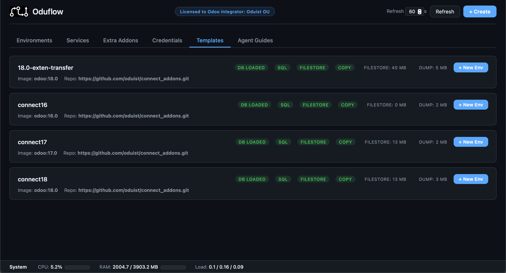

# Template Management

[TOC]



Templates are the foundation of Oduflow's instant environment creation. A template consists of a PostgreSQL dump file and an optional filestore directory.

Create templates from production dumps, staging snapshots, or from scratch. Maintain **multiple named templates** side-by-side (e.g. per Odoo version, per client, per project phase) and spin up any combination of branch + database in seconds.

## Starting from Scratch (No Production Dump)

If you don't have a production database dump — for example, you're starting a new Odoo project or just want to try Oduflow — you can generate a clean template automatically.

### Generate a clean template

```bash
oduflow init-template --odoo-image odoo:17.0 --template-name default
```

If a `dump.sql` or filestore already exists, the command will refuse to run. Use `--force` to overwrite:

```bash
oduflow init-template --odoo-image odoo:17.0 --template-name default --force
```

This will:

1. Start a PostgreSQL container (if not already running)
2. Run a temporary Odoo container that initializes a fresh database with the `base` module
3. Dump the database to `{data_dir}/team_{ID}/templates/{name}/dump.pgdump`
4. Extract the filestore to `{data_dir}/team_{ID}/templates/{name}/filestore/`
5. Load the dump into the template database automatically

### Install additional modules during generation

```bash
oduflow init-template --odoo-image odoo:17.0 --template-name default --modules base,web,contacts,sale
```

### Named templates for different projects

```bash
oduflow init-template --odoo-image odoo:17.0 --template-name myproject-v17
oduflow init-template --odoo-image odoo:15.0 --template-name legacy-v15
```

## From a Production Dump

Place your dump file at `{data_dir}/team_{ID}/templates/default/dump.sql` (plain SQL) or `dump.pgdump` (PostgreSQL custom format) and optionally copy the filestore:

```bash
mkdir -p /srv/oduflow/team_1/templates/default/
cp /path/to/production.sql /srv/oduflow/team_1/templates/default/dump.sql
cp -r /path/to/filestore/ /srv/oduflow/team_1/templates/default/filestore/
oduflow reload-template default
```

## Editing the Template Database

Once you have a template, you can modify it interactively — install modules, configure settings, create demo data — and save the result back as the new template.

**Start the template editor:**

```bash
oduflow template-up --odoo-image odoo:17.0 --template-name default
```

This starts an Odoo container that works **directly** with the template database and filestore (no overlays, no copies). Open the printed URL in your browser, log in, and make any changes you need.

**Save and stop:**

```bash
oduflow template-down --template-name default
```

This stops the container, dumps the updated database, and restores the PostgreSQL template flag. The filestore is already updated in place since it was mounted directly.

All environments created after this will be based on the updated template.

## Saving a Branch as Template

When you've made significant changes in a branch environment (installed modules, created configurations), you can save it as the new template:

```bash
oduflow template-from-env my-branch --template-name default
oduflow template-from-env my-branch --template-name myproject  # save to a named template
```

This operation:

1. Dumps the branch database to a new template dump file
2. Reloads the template database from the new dump
3. Snapshots the branch's merged filestore
4. Unmounts all overlay filesystems across active environments
5. Replaces the template filestore with the snapshot
6. Remounts overlays for all active environments (clearing their upper dirs)
7. Restarts all active containers

!!! warning
    **Destructive operation**: All other environments lose their filestore deltas and are reset to the new baseline.

## Reloading a Template

Update the template from a newer production dump without touching the filestore:

```bash
oduflow reload-template default --dump-path /path/to/new.dump
oduflow reload-template myproject --dump-path /path/to/new.dump
```

## Listing and Dropping Templates

```bash
# List all template profiles with their status
oduflow list-templates

# Delete a template profile (removes DB + files from disk)
oduflow delete-template myproject
```

## Template Metadata

Each template profile can contain a `metadata.json` file that stores defaults and configuration:

```json
{
  "odoo_image": "odoo:17.0",
  "repo_url": "https://github.com/company/addons.git",
  "extra_addons": {"enterprise": "17.0"},
  "use_overlay": true,
  "source_url": "https://my-odoo.example.com",
  "source_db": "production",
  "odoo_version": "17.0+e",
  "pg_version": "15.0"
}
```

When `create_environment` is called with a template name, `repo_url`, `odoo_image`, and `extra_addons` are automatically loaded from metadata if not explicitly provided. This means after importing or configuring a template, you can create environments with just `branch` and `template_name` — all other parameters are inherited.

The `use_overlay` flag determines whether new environments use fuse-overlayfs (for large filestores) or a simple copy (for small ones). It is set automatically based on `overlay_threshold_mb` (in `[storage]`) when the template is created.

## Template Decision Matrix

| Scenario | Command |
|---|---|
| New project, no existing database | `oduflow init-template --odoo-image odoo:17.0 --template-name default` |
| Regenerate template from scratch | `oduflow init-template --odoo-image odoo:17.0 --template-name default --force` |
| Named template for a specific project | `oduflow init-template --odoo-image odoo:17.0 --template-name myproject` |
| Have a production dump file | Place dump at `{data_dir}/team_{ID}/templates/default/dump.sql` and run `oduflow reload-template default` |
| Need to install modules or configure the template | `oduflow template-up --odoo-image odoo:17.0 --template-name default` / `oduflow template-down --template-name default` |
| Update the template from a newer production dump | `oduflow reload-template default --dump-path /path/to/new.dump` |
| Save a branch environment as template | `oduflow template-from-env my-branch --template-name default` |
| List all templates | `oduflow list-templates` |
| Delete a template | `oduflow delete-template myproject` |
