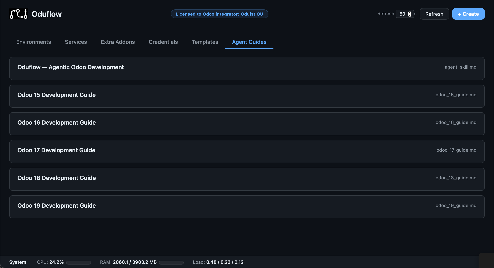

# Web Dashboard & REST API

## Web Dashboard

HTTP mode serves the dashboard at `/`. It manages environments, templates,
services, volumes, extra addons, credentials, licenses, usage/quotas, and—when
enabled—coding agents and productions. Environment cards also expose logs,
Odoo/SQL terminals, Connect As, notes, protection, scoped MCP access, and
save-as-template actions.

The header's **Feedback** action opens a prefilled issue form on
`github.com/oduist/oduflow`. Oduflow holds no GitHub credentials and files
nothing itself: it builds the link with the description and a short
version/platform/transport block, then the user reviews and submits it from
their own GitHub account.

## Authentication and responses

Dashboard API routes use the authenticated UI session (user `admin`, password
from `[team.*].ui_password`). The login form creates an HTTP-only session
cookie; HTTP Basic credentials are also accepted. State-changing cookie-auth
requests and all WebSocket handshakes are protected by Origin/Referer checks.
This authentication is separate from MCP Bearer authentication.

Most REST handlers return JSON containing `ok`. Three public surfaces use their
own security model:

- `/healthz` is unauthenticated and contains no secrets.
- `/api/webhooks/github` verifies `X-Hub-Signature-256` against the production
  webhook secret.
- Odoo.sh import ingest routes require a short-lived Bearer import token. The
  token-minting endpoint remains UI-authenticated.

`/oduflow-connect` is a one-time, token-authenticated browser redirect rather
than a JSON API. Production routes are registered only when
`[production].enabled = true`.

## Environment endpoints

| Method | Endpoint | Description |
|---|---|---|
| `GET` | `/api/environments` | List environments |
| `POST` | `/api/environments/create` | Create an environment. Body: `env_name`, optional `hostname`, `repo_url`, `odoo_image`, `template_name`, `extra_addons`, `auto_install_modules`, `env_vars` (merged per key over the template's), `git_user` |
| `POST` | `/api/environments/{branch}/start` | Start an environment |
| `POST` | `/api/environments/{branch}/stop` | Stop an environment |
| `POST` | `/api/environments/{branch}/restart` | Restart its Odoo container |
| `POST` | `/api/environments/{branch}/sync` | Pull and automatically apply code changes |
| `POST` | `/api/environments/{branch}/switch-branch` | Move the environment onto another git branch, keeping DB, filestore and URL, then apply the difference. Body: `branch`, optional `new_name` to rename the environment at the same time. The response's `env_name` is the name to address it by afterwards |
| `POST` | `/api/environments/{branch}/update` | Recreate the container while preserving DB and filestore. Optional body: `env_vars` (full replacement of the user-supplied container variables — either an object mapping names to values, or a `KEY=VALUE` string separated by newlines or commas; an empty object/string clears them, an absent key keeps them). The dashboard sends an object, so a value may contain commas, `odoo_image` |
| `GET` | `/api/environments/{branch}/env-vars` | Return the user-supplied container environment variables |
| `POST` | `/api/environments/{branch}/recreate` | Delete and recreate with the recorded parameters |
| `POST` | `/api/environments/{branch}/delete` | Delete the environment |
| `GET` | `/api/environments/{branch}/logs?n=200&container=` | Read environment logs; optionally select a container |
| `POST` | `/api/environments/{branch}/protect` | Protect from stop/delete |
| `POST` | `/api/environments/{branch}/unprotect` | Remove protection |
| `POST` | `/api/environments/{branch}/note` | Store the body `note` on the environment |
| `POST` | `/api/environments/{branch}/storage/refresh` | Refresh cached DB/workspace sizes |
| `GET` | `/api/environments/{branch}/mcp-access` | Return the scoped MCP URL and per-environment token |
| `GET` | `/api/environments/{branch}/users` | List internal and portal users for Connect As |
| `POST` | `/api/environments/{branch}/connect-as` | Mint an Odoo session for body `user` and return URL/cookie details |
| `GET` | `/api/environments/{branch}/connect-open?user=` | Mint a session and redirect toward the environment login handoff |
| `POST` | `/api/environments/{branch}/save-as-template` | Save the environment under body `template_name`; the UI never overwrites an existing template |

Branch parameters use Starlette's `path` converter internally, so names that
contain `/` are accepted and URL-decoded as one environment name.

## Environment WebSockets

| Protocol | Endpoint | Description |
|---|---|---|
| `WebSocket` | `/api/environments/{branch}/terminal` | Interactive `odoo shell` terminal |
| `WebSocket` | `/api/environments/{branch}/sql` | Interactive `psql` terminal using the environment-scoped DB role |
| `WebSocket` | `/api/environments/{branch}/agent` | Hosted Agent CLI PTY |
| `WebSocket` | `/api/environments/{branch}/agent-acp` | Hosted Agent Chat ACP relay |

## Templates and Odoo imports

| Method | Endpoint | Description |
|---|---|---|
| `GET` | `/api/templates` | List template profiles |
| `GET` | `/api/templates/{name:path}/metadata` | Read the complete `metadata.json` content and its optimistic revision |
| `PUT` | `/api/templates/{name:path}/metadata` | Validate and atomically replace `metadata.json`; body: `content`, `revision` |
| `POST` | `/api/templates/{name}/delete` | Delete a template |
| `POST` | `/api/templates/{name}/rename` | Rename it; body: `new_name` |
| `POST` | `/api/templates/import-from-odoo` | UI-authenticated: pull a backup from a running Odoo. Body: `odoo_url`, `master_pwd`, `template_name`, optional `db_name`, optional boolean `without_filestore` |
| `POST` | `/api/templates/import-token` | UI-authenticated: mint a 15-minute Odoo.sh import token |
| `GET` | `/api/templates/import/status` | Import-token authenticated: report resumable upload progress |
| `POST` | `/api/templates/import/manifest` | Upload template metadata |
| `POST` | `/api/templates/import/dump` | Stream/chunk the compressed SQL dump |
| `POST` | `/api/templates/import/filestore` | Upload one atomic filestore hash-directory archive |
| `POST` | `/api/templates/import/addon` | Stream/chunk one private addon archive |
| `POST` | `/api/templates/import/addon-remote` | Register an addon repo that the server can clone |
| `POST` | `/api/templates/import/finalize` | Validate staged data and atomically publish/restore the template |
| `GET` | `/import-odoo.sh` | Download the token-authenticated Odoo.sh import client |

The pull-import endpoint accepts HTTP and HTTPS source URLs. HTTP sends the Odoo
master password without transport encryption, so HTTPS remains recommended.
Loopback, link-local, metadata, and private-network targets remain blocked by
the outbound URL safety check.

Odoo.sh ingest endpoints accept the import token only in
`Authorization: Bearer ...`, not in the URL. See
[Template Management](templates.md) for the supported import workflow.

## Services, PostgreSQL databases, presets, and volumes

| Method | Endpoint | Description |
|---|---|---|
| `GET` | `/api/services` | List services |
| `POST` | `/api/services/create` | Create a service with either catch-all `port` or restricted Traefik `routes`, plus optional image/runtime settings |
| `POST` | `/api/services/{name}/update` | Pull/change settings and recreate safely; `env_vars`, `volumes`, and `routes` are full replacements when supplied |
| `POST` | `/api/services/{name}/restart` | Restart a service |
| `POST` | `/api/services/{name}/delete` | Delete a service |
| `GET` | `/api/services/{name}/logs?n=200` | Read service logs |
| `GET` | `/api/service-databases` | List managed sidecar databases without passwords |
| `POST` | `/api/service-databases/create` | Create a database and scoped role; body: `name` |
| `POST` | `/api/service-databases/{name}/credentials` | Explicitly reveal connection credentials and `DATABASE_URL` |
| `POST` | `/api/service-databases/{name}/rotate` | Rotate the database role password |
| `POST` | `/api/service-databases/{name}/delete` | Permanently drop the database and role, terminating connections |
| `GET` | `/api/service-presets` | List saved presets |
| `POST` | `/api/service-presets/restore` | Restore a preset; body: `name` plus optional runtime overrides |
| `POST` | `/api/service-presets/{name}/delete` | Delete a preset |
| `GET` | `/api/volumes` | List managed volumes and service usage |
| `POST` | `/api/volumes/create` | Create a volume; body: `name`, optional `description` |
| `POST` | `/api/volumes/{name}/delete` | Delete an unused volume |

Service databases live in the shared development PostgreSQL cluster, inside the
current team's tablespace. They have a dedicated non-superuser owner and persist
independently of service containers. Bridge-mode services reach them through
the returned PostgreSQL container hostname; host-network services are not
supported because the cluster is not published on a host port.

## Extra addons and credentials

| Method | Endpoint | Description |
|---|---|---|
| `GET` | `/api/extra-repos` | List extra-addon repositories |
| `POST` | `/api/extra-repos/add` | Add one; body: `name`, `repo_url`, optional `git_user` |
| `POST` | `/api/extra-repos/{name}/pull` | Fetch remote changes |
| `POST` | `/api/extra-repos/{name}/protect` | Protect from deletion |
| `POST` | `/api/extra-repos/{name}/unprotect` | Remove protection |
| `POST` | `/api/extra-repos/{name}/delete` | Delete the repository and unused cached revisions |
| `GET` | `/api/credentials` | List stored credential identities (not secrets) |
| `POST` | `/api/credentials/add` | Store credentials embedded in body `repo_url` |
| `POST` | `/api/credentials/delete` | Delete by body `host` and `username` |
| `POST` | `/api/credentials/validate` | Validate by body `host` and `username` |

## System, licensing, and guides

| Method | Endpoint | Description |
|---|---|---|
| `GET` | `/api/stats` | Container/system metrics plus cached environment storage |
| `GET` | `/api/usage` | Cached per-environment and team storage/quotas |
| `POST` | `/api/usage/refresh` | Recompute all team storage usage; potentially expensive |
| `GET` | `/healthz` | Public health report; returns `200` when healthy, `503` when degraded |
| `GET` | `/api/license` | License information |
| `POST` | `/api/license/activate` | Activate body `key` |
| `POST` | `/api/feedback/link` | Build a prefilled `github.com/oduist/oduflow` issue URL. Body: required `details`; optional `kind` (`bug`, `feature`, or `feedback`) and `title` |
| `GET` | `/api/agent-guides` | List available agent guides |
| `GET` | `/api/agent-guides/{filename}` | Read a guide |

## Coding agent endpoints

These endpoints and the WebSocket surfaces are useful only for teams with
`agent_enabled = true`; the dashboard hides agent actions for live-mounted
environments.

| Method | Endpoint | Description |
|---|---|---|
| `GET` | `/api/agent` | Agent enablement and effective default (`claude`, `codex`, or `opencode`) |
| `GET` | `/api/environments/{branch}/agent-acp/info?type=` | ACP working directory, selected/recent sessions, and attachment limits |
| `POST` | `/api/environments/{branch}/agent-acp/session` | Select, title, or clear the current session for body `type` |
| `POST` | `/api/environments/{branch}/agent-acp/attachments?name=` | Stream an attachment into the agent checkout |
| `DELETE` | `/api/environments/{branch}/agent-acp/attachments/{upload_id}` | Delete an unsent attachment |

## Production endpoints

These routes exist only when production hosting is enabled. Destructive restore
and delete operations require explicit confirmation in their JSON body.

| Method | Endpoint | Description |
|---|---|---|
| `GET` | `/api/productions` | List productions and return webhook/backup state |
| `POST` | `/api/productions/create` | Create a production from repository/image/domain settings, optionally a template |
| `GET` | `/api/productions/backup-status` | Team backup, WAL-G, base-backup, and S3 health |
| `GET` | `/api/productions/{name}` | Detailed production information |
| `POST` | `/api/productions/{name}/start` | Start |
| `POST` | `/api/productions/{name}/stop` | Stop |
| `POST` | `/api/productions/{name}/restart` | Restart |
| `POST` | `/api/productions/{name}/update` | Start an asynchronous deploy; returns `202` |
| `POST` | `/api/productions/{name}/rollback?to_commit=` | Roll code back to a commit |
| `POST` | `/api/productions/{name}/auto-update` | Set body `enabled` for webhook deploys |
| `GET` | `/api/productions/{name}/logs?lines=200` | Read up to 2,000 log lines |
| `GET` | `/api/productions/{name}/deploys` | Read recent deploy history |
| `POST` | `/api/productions/{name}/delete` | Delete; body `confirm` must equal name, optional `drop_database` |
| `GET` | `/api/productions/{name}/snapshots?refresh=true` | List S3 snapshots, optionally bypassing cache |
| `POST` | `/api/productions/{name}/snapshot` | Take a snapshot now |
| `POST` | `/api/productions/{name}/restore` | Restore body `snapshot_id`; body `confirm` must equal name |
| `POST` | `/api/productions/{name}/backup-schedule` | Set body `schedule` to `HH:MM` or `off` |
| `POST` | `/api/webhooks/github` | Public HMAC-authenticated GitHub push webhook |

See [Production Hosting](production.md) for deploy, rollback, backup, and PITR
semantics.

## Browser routes

| Method | Endpoint | Description |
|---|---|---|
| `GET` | `/` | Dashboard application |
| `GET`, `POST` | `/login` | UI login form |
| `POST` | `/logout` | Clear the UI session |
| `GET` | `/oduflow-connect?token=` | One-time environment-host login handoff; sets Odoo `session_id` and redirects to `/web` |
| `GET` | `/favicon.ico`, `/logo.png`, `/static/{filename}` | Packaged dashboard assets |
